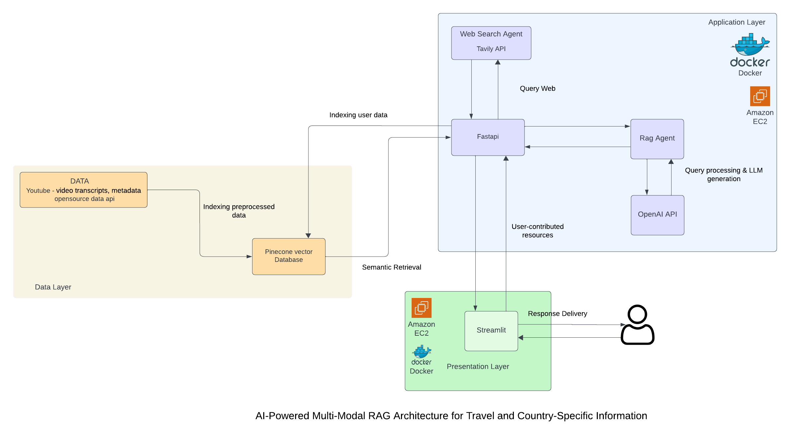

# WanderWise: AI-Powered Travel Planner

**WanderWise** is an intelligent travel planning tool that integrates AI, real-time web search, and YouTube video data to provide users with highly personalized travel recommendations. Users can create, modify, and download detailed itineraries with ease through a conversational chatbot interface.

---

## Key Features

- **Personalized Recommendations**:
  - Travel itineraries tailored to user preferences.
- **Dual Helper System**:
  - **RAG Helper**: Fetches stored data from a Pinecone vector database.
  - **Web Search Helper**: Provides real-time updates using web APIs.
- **YouTube Integration**:
  - Enriches recommendations with YouTube travel content.
- **User-Friendly Design**:
  - Built with **Streamlit** (Frontend) and **FastAPI** (Backend).
- **Downloadable Itineraries**:
  - Users can export travel plans as PDFs.

---

## Tools and Technologies

- **Programming Languages**: Python
- **AI Models**: OpenAI GPT-3.5 Turbo, OpenAI Text Ada
- **Databases**: Pinecone Vector Database
- **APIs**: YouTube API, Tavily Web Search API
- **Development Tools**: Streamlit, FastAPI, Docker

---

## Folder Structure

```
.github/workflows/
    deployment.yml                # GitHub deployment workflow

Streamlit/
    app.py                        # Main Streamlit application file
    chat_page.py                  # Chatbot interface
    login_page.py                 # User login functionality
    signup_page.py                # User signup functionality
    welcome_page.py               # Welcome page for the app
    requirements.txt              # Python dependencies for Streamlit
    Dockerfile                    # Docker setup for the Streamlit app
    travel_itinerary.pdf          # Sample exported itinerary

fast_api/
    main.py                       # FastAPI backend main file
    openai_response.py            # AI response handling
    websearch_normal.py           # Handles real-time web search
    youtube_search.py             # YouTube data integration
    requirements.txt              # Python dependencies for FastAPI
    Dockerfile                    # Docker setup for the FastAPI backend

youtube/
    youtube.py                    # YouTube data management
    transcripts.py                # Processing YouTube transcripts

docker-compose.yml                # Docker Compose file for orchestrating services
```

---

## Architecture Diagram



---

## How to Run the Project

### Prerequisites
- Python 3.10.12
- Docker installed

### Steps
1. Clone the repository.
   ```bash
   git clone <repo_url>
   cd <repo_directory>
   ```

2. Start the backend with Docker:
   ```bash
   docker-compose up --build
   ```

3. Access the application on your browser at `http://localhost:8501`.

---

## License
This project is licensed under the MIT License.
